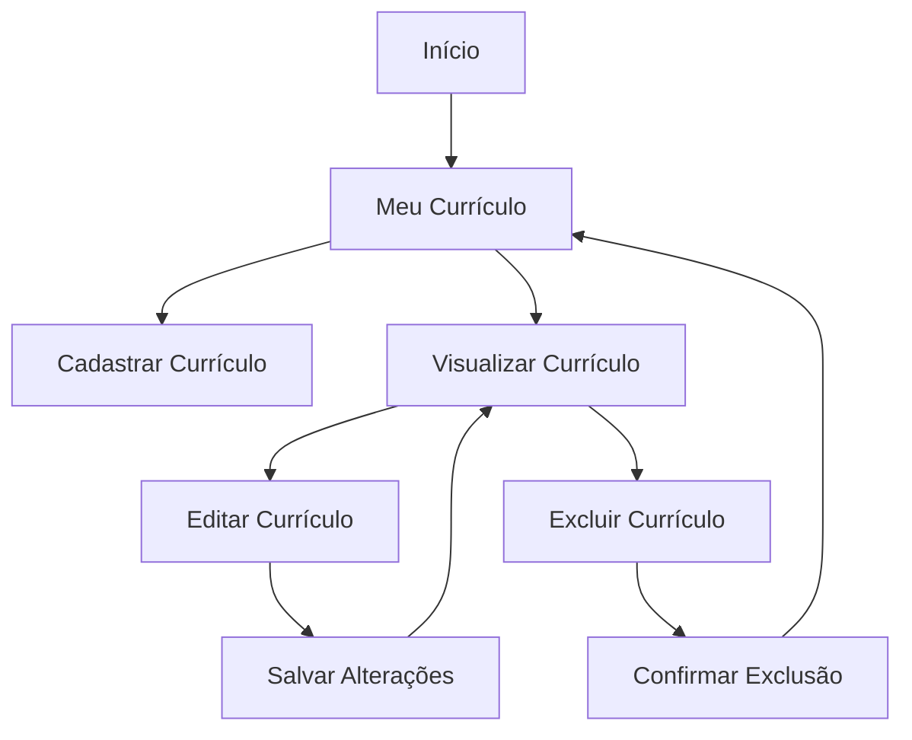
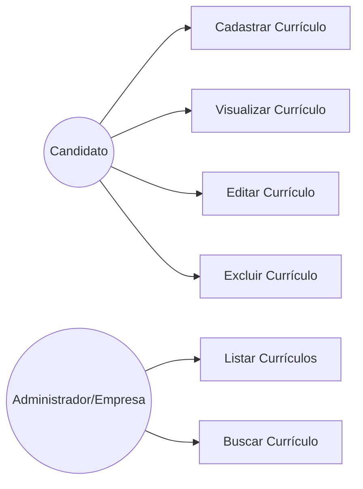
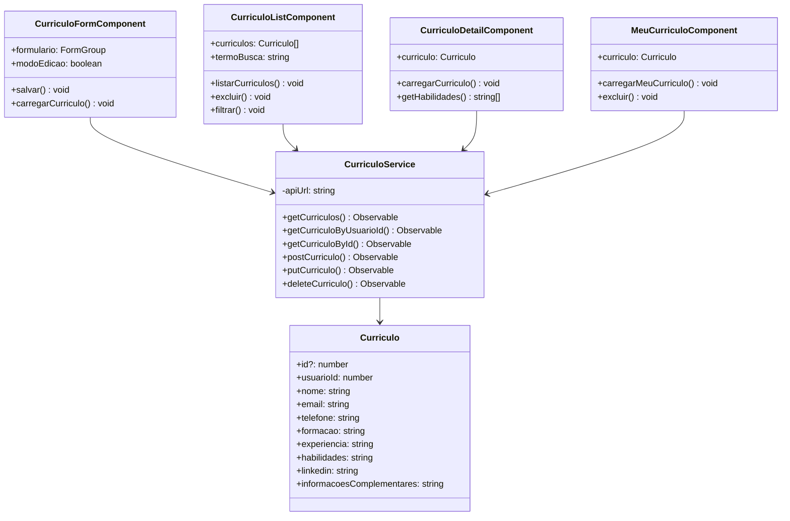
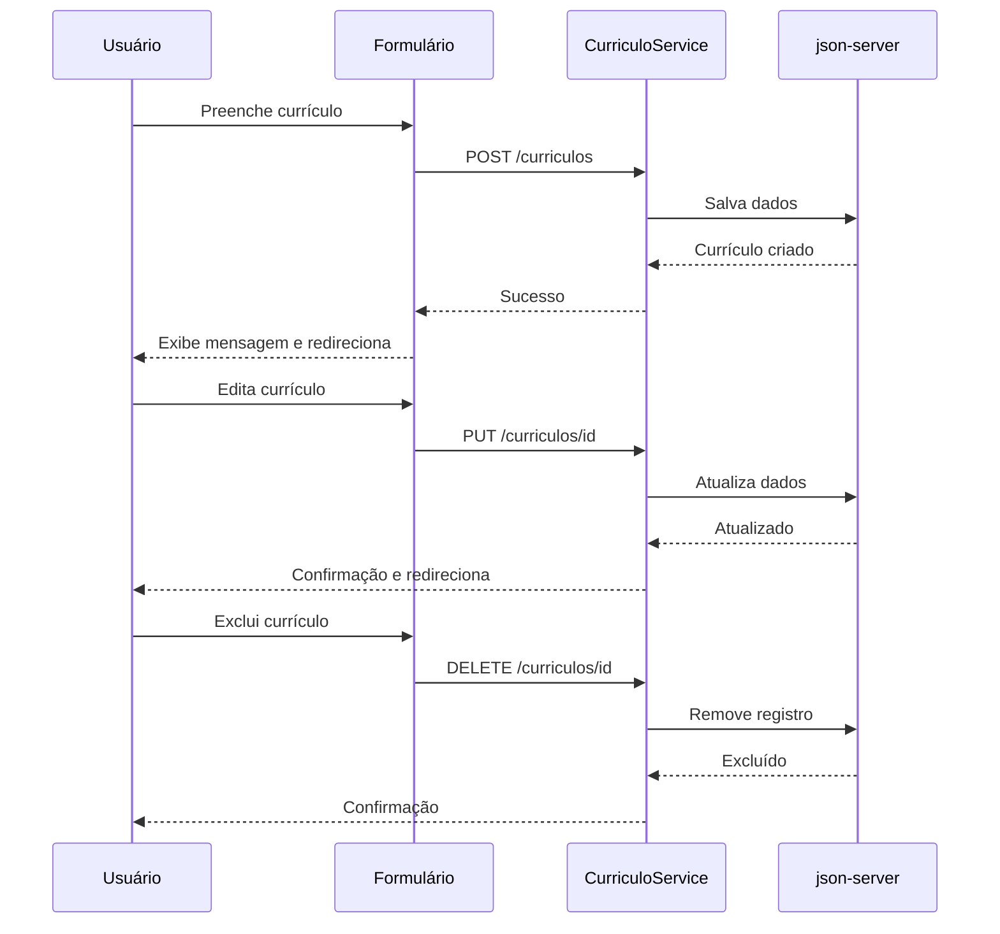

# Especificação de Requisitos de Software (SRS)

**Projeto:** Plataforma RH – Módulo de Currículos
**Versão:** 1.0
**Data:** 18/06/2026

---

# 1. Introdução

## 1.1 Propósito

Este documento descreve os requisitos funcionais e não funcionais para o Módulo de Currículos da Plataforma RH. O objetivo é permitir que candidatos realizem o gerenciamento completo de seus currículos, incluindo cadastro, edição, visualização e exclusão de informações profissionais, enquanto administradores e empresas podem visualizar os currículos vinculados às candidaturas.

## 1.2 Escopo

O sistema compreende o desenvolvimento de uma interface frontend utilizando Angular integrada a um backend simulado através do json-server.

O módulo permite:

* Cadastro de currículos por candidatos;
* Edição e atualização de informações profissionais;
* Visualização do próprio currículo;
* Listagem de currículos para administradores e empresas;
* Persistência dos dados em arquivo `db.json`;
* Navegação entre telas utilizando Angular Router sem recarregar a página;
* Utilização de formulários reativos com validações.

---

# 2. Descrição Geral

## 2.1 Objetivos de Aprendizagem

Ao final desta situação de aprendizagem, será possível:

* Compreender e implementar interfaces de dados para Currículo;
* Criar e utilizar serviços Angular com `HttpClient` para realizar operações CRUD;
* Desenvolver formulários reativos com validações;
* Configurar e gerenciar rotas no Angular;
* Organizar o código em componentes reutilizáveis;
* Reaproveitar padrões utilizados nos módulos de vagas e empresas;
* Implementar interfaces intuitivas utilizando Angular Material;
* Aplicar boas práticas de desenvolvimento frontend.

## 2.2 Cenário

Imagine que você está desenvolvendo o módulo de currículos para a Plataforma RH. Os usuários recém-cadastrados precisam ter um local para registrar suas informações profissionais detalhadas, como formação acadêmica, experiências profissionais, habilidades e perfil LinkedIn.

Essas informações são armazenadas no backend simulado e podem ser visualizadas tanto pelos próprios candidatos quanto por empresas e administradores de forma simulada.

---

# 3. Requisitos do Sistema

## 3.1 Requisitos Funcionais (RF)

### RF01 – Cadastro de Currículo
O sistema permite que o usuário crie um currículo preenchendo:
* Nome completo;
* E-mail;
* Telefone;
* Formação acadêmica;
* Experiência profissional;
* Habilidades;
* Perfil LinkedIn (opcional);
* Informações complementares.

### RF02 – Vinculação ao Usuário
O currículo é associado ao usuário logado através do campo `usuarioId` (simulado com id fixo `1` para fins didáticos).

### RF03 – Edição de Currículo
O sistema permite que o usuário altere informações previamente cadastradas através da rota `/curriculos/editar/:id`.

### RF04 – Visualização de Currículo
O usuário pode visualizar seu currículo completo em `/meu-curriculo`, com layout de perfil profissional.

### RF05 – Exclusão de Currículo
O sistema permite a remoção de currículos com confirmação prévia do usuário.

### RF06 – Listagem de Currículos
A rota `/curriculos` disponibiliza uma listagem para administradores e empresas com busca por nome, habilidade ou formação.

### RF07 – Busca por Usuário
O serviço recupera e filtra currículos pelo identificador do usuário usando query string do json-server (`?usuarioId=1`).

### RF08 – Persistência de Dados
Os dados são armazenados e recuperados através do json-server (`backend/db.json`).

### RF09 – Feedback ao Usuário
Mensagens informando sucesso ou falha são exibidas após cada operação CRUD.

### RF10 – Navegação
O Angular Router gerencia toda a navegação entre as telas de cadastro, edição e visualização intuitivamente.

---

## 3.2 Requisitos Não Funcionais (RNF)

| Código | Requisito | Status |
|--------|-----------|--------|
| RNF01 | Frontend desenvolvido em Angular 21 | ✅ |
| RNF02 | Backend simulado e persistido com json-server | ✅ |
| RNF03 | Interface responsiva (mobile e desktop) | ✅ |
| RNF04 | Navegação intuitiva e de fácil utilização | ✅ |
| RNF05 | Componentes reutilizáveis e organizados | ✅ |
| RNF06 | Formulários Reativos (ReactiveFormsModule) | ✅ |
| RNF07 | Validação adequada de campos obrigatórios | ✅ |
| RNF08 | Desempenho adequado das operações CRUD em ambiente local | ✅ |
| RNF09 | Manutenibilidade seguindo boas práticas de desenvolvimento | ✅ |
| RNF10 | Experiência do usuário utilizando componentes do Angular Material | ✅ |

---

# 4. Interface de Dados e Modelagem do Sistema

## 4.1 Model de Currículo

```typescript
// src/app/model/curriculo.model.ts
export interface Curriculo {
  id?: number;
  usuarioId: number;
  nome: string;
  email: string;
  telefone: string;
  formacao: string;
  experiencia: string;
  habilidades: string;
  linkedin: string;
  informacoesComplementares?: string;
}

```

## 4.2 Serviço HTTP – CurriculoService

```typescript
// src/app/service/curriculo.service.ts
getCurriculos(): Observable<Curriculo[]>
getCurriculoByUsuarioId(usuarioId: number): Observable<Curriculo[]>
getCurriculoById(id: number): Observable<Curriculo>
postCurriculo(curriculo: Curriculo): Observable<Curriculo>
putCurriculo(curriculo: Curriculo): Observable<Curriculo>
deleteCurriculo(id: number): Observable<void>

```

## 4.3 Rotas Configuradas

| Rota | Componente | Descrição |
| --- | --- | --- |
| `/` | `Inicio` | Página inicial |
| `/vagas` | `Vagas` | Listagem pública de vagas |
| `/painel-vagas` | `PainelVagas` | CRUD administrativo de vagas |
| `/curriculos` | `CurriculoList` | Listagem admin/empresas de currículos |
| `/curriculos/novo` | `CurriculoForm` | Cadastrar novo currículo |
| `/curriculos/editar/:id` | `CurriculoForm` | Editar currículo existente |
| `/curriculos/detalhe/:id` | `CurriculoDetail` | Detalhes de um currículo |
| `/meu-curriculo` | `MeuCurriculo` | Currículo do usuário logado |

## 4.4 Componentes Implementados

### CurriculoFormComponent

* Cadastro e edição de currículo (modo detectado via parâmetro `:id` na rota);
* Formulário reativo com `FormBuilder`;
* Validações: campos obrigatórios, e-mail, minlength, URL;
* Feedback visual em tempo real por campo e envio ao serviço;
* Mensagem de sucesso/erro após operação;
* Redirecionamento automático para `/meu-curriculo` após salvar.

### CurriculoListComponent

* Listagem administrativa de todos os currículos (simula visão por empresas);
* Campo de busca em tempo real (nome, habilidade, formação);
* Ações por linha: Ver, Editar, Excluir;
* Confirmação antes de excluir;
* Contador de currículos filtrados.

### CurriculoDetailComponent

* Exibição detalhada de um currículo individual;
* Avatar gerado pela inicial do nome;
* Habilidades renderizadas como tags visuais;
* Links para LinkedIn e para edição.

### MeuCurriculoComponent

* Visão do candidato sobre o próprio currículo;
* Busca automática pelo `usuarioId` simulado;
* Estado vazio com call-to-action para cadastro;
* Ações de editar e excluir integradas.

---

## 4.5 Fluxo de Navegação



---

## 4.6 Caso de Uso



---

## 4.7 Diagrama de Classes



---

## 4.8 Fluxo CRUD Completo



---

# 5. Critérios de Aceitação

| # | Critério | Status |
| --- | --- | --- |
| 1 | É possível criar, ler, atualizar e excluir registros via interface? | ✅ |
| 2 | As rotas navegam para os componentes corretos sem erros? | ✅ |
| 3 | O usuário recebe feedback visual após salvar, editar ou excluir? | ✅ |
| 4 | Os dados exibidos correspondem aos armazenados no backend? | ✅ |
| 5 | Os campos obrigatórios impedem o envio de dados inválidos? | ✅ |
| 6 | O currículo é corretamente associado ao `usuarioId` logado? | ✅ |
| 7 | Administradores e empresas conseguem visualizar os currículos listados? | ✅ |
| 8 | Os dados persistem disponíveis após atualização da aplicação? | ✅ |

---

# 6. Configuração do Ambiente

## Pré-requisitos

* Node.js 20+ instalado;
* Angular CLI instalado globalmente;
* json-server instalado globalmente.

## Instalação do Angular CLI

```bash
npm install -g @angular/cli

```

## Instalação do json-server

```bash
npm install -g json-server

```

## Instalação das Dependências do Projeto

```bash
cd sa-rh-completo
npm install

```

## Inicialização do Backend Simulado

```bash
json-server --watch backend/db.json --port 3003

```

O backend estará disponível em: `http://localhost:3003`

Endpoints disponíveis:

* `GET/POST http://localhost:3003/vagas`
* `GET/POST http://localhost:3003/curriculos`
* `GET/PUT/DELETE http://localhost:3003/curriculos/:id`
* `GET http://localhost:3003/curriculos?usuarioId=1`

## Inicialização da Aplicação Angular

Em outro terminal:

```bash
ng serve

```

A aplicação estará disponível em: `http://localhost:4200`

---

# 7. Validações do Formulário de Currículo

| Campo | Regra | Mensagem de erro |
| --- | --- | --- |
| Nome | Obrigatório, mín. 3 chars | "Nome é obrigatório" / "Mínimo de 3 caracteres" |
| E-mail | Obrigatório, formato e-mail | "E-mail é obrigatório" / "Informe um e-mail válido" |
| Telefone | Obrigatório | "Telefone é obrigatório" |
| Formação | Obrigatório, mín. 10 chars | "Formação é obrigatória" / "Descreva melhor..." |
| Experiência | Obrigatório, mín. 10 chars | "Experiência é obrigatória" / "Descreva melhor..." |
| Habilidades | Obrigatório | "Habilidades são obrigatórias" |
| LinkedIn | Opcional, deve iniciar com http | "Informe uma URL válida (https://...)" |

---

# 8. Competências Avaliadas

## Desenvolvimento Frontend com Angular

* Uso do Angular CLI;
* Criação de componentes standalone e estruturação de módulos;
* Estruturação em camadas (model / service / view);
* Arquitetura baseada em componentes.

## Manipulação de Dados e Requisições HTTP

* Consumo de APIs REST com `HttpClientModule`;
* Operações CRUD completas (GET, POST, PUT, DELETE);
* Uso de Observables e RxJS;
* Filtro via query string no json-server.

## Gerenciamento de Estado e Formulários

* Criação de formulários reativos com `FormBuilder`;
* Validação de campos com `Validators`;
* Feedback visual por campo e mensagem global;
* Detecção automática de modo (criar vs editar).

## Roteamento e Navegação

* Configuração do Angular Router;
* Navegação entre telas com `RouterLink` e passagem de parâmetros;
* Leitura de parâmetros via `ActivatedRoute`;
* Redirecionamento programático com `Router.navigate`.

## Organização e Boas Práticas

* Estrutura de pastas por funcionalidade;
* Interfaces TypeScript para modelos de dados;
* Separação de responsabilidades (service / component);
* Reutilização de componentes e serviços;
* SCSS modular por componente e uso de Angular Material.

## Resolução de Problemas

* Identificação e correção de erros de integração;
* Adaptação a backend simulado (json-server);
* Aplicação de conhecimentos adquiridos nos módulos de vagas e empresas para o módulo de currículos.