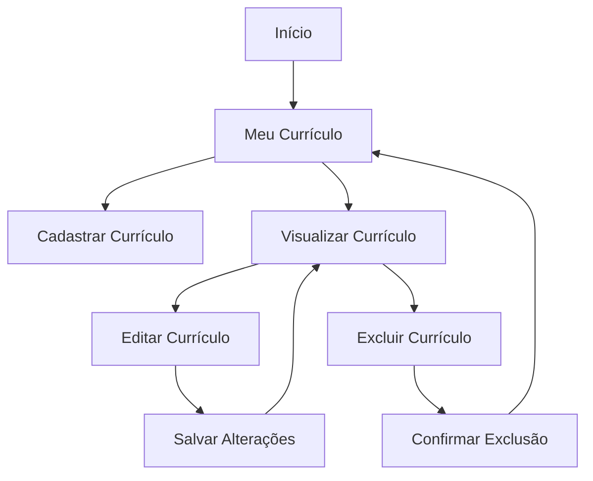
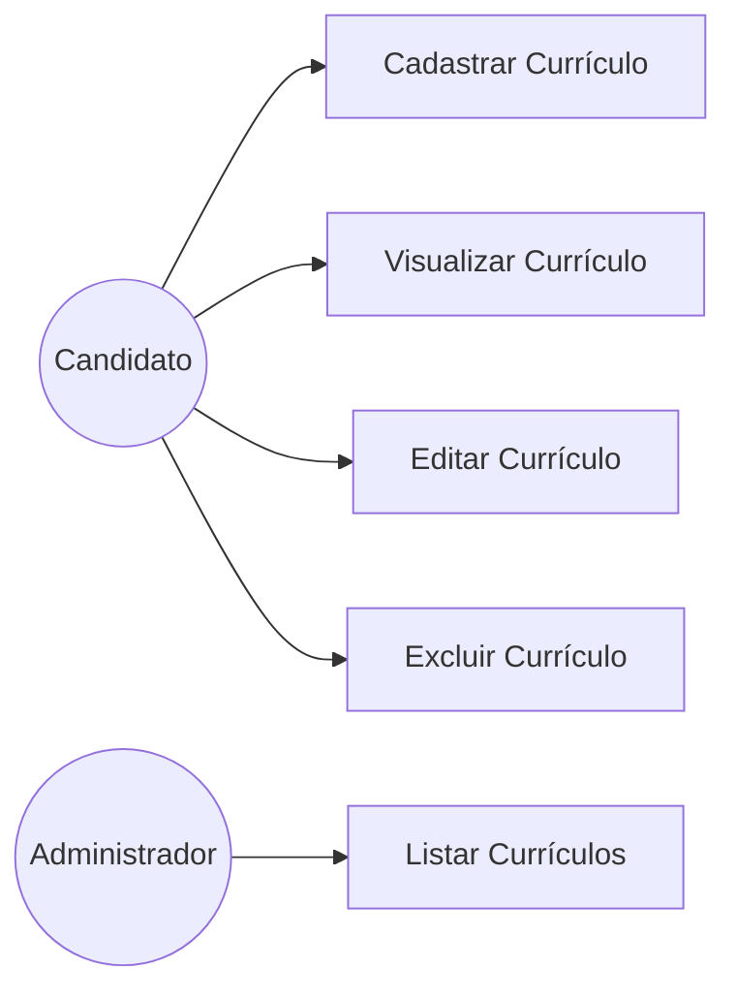
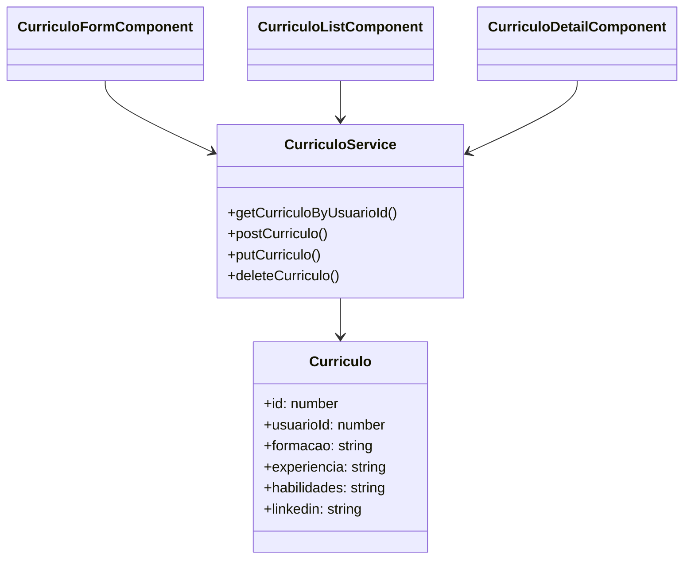
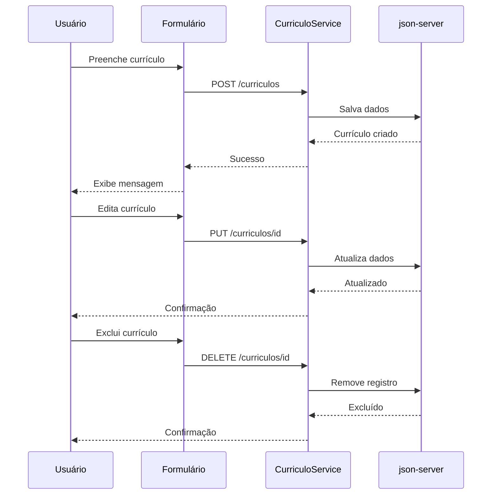

# Especificação de Requisitos de Software (SRS)

**Projeto:** Plataforma RH – Módulo de Currículos
**Versão:** 1.0
**Data:** 02/06/2026

---

# 1. Introdução

## 1.1 Propósito

Este documento descreve os requisitos funcionais e não funcionais para o Módulo de Currículos da Plataforma RH. O objetivo é permitir que candidatos realizem o gerenciamento completo de seus currículos, incluindo cadastro, edição, visualização e exclusão de informações profissionais, enquanto administradores e empresas podem visualizar os currículos vinculados às candidaturas.

## 1.2 Escopo

O sistema compreende o desenvolvimento de uma interface frontend utilizando Angular integrada a um backend simulado através do json-server.

O módulo permitirá:

* Cadastro de currículos por candidatos;
* Edição e atualização de informações profissionais;
* Visualização do próprio currículo;
* Listagem de currículos para administradores e empresas;
* Persistência dos dados em arquivo `db.json`;
* Navegação entre telas utilizando Angular Router;
* Utilização de formulários reativos e validações.

---

# 2. Descrição Geral

## 2.1 Objetivos de Aprendizagem

Ao final desta situação de aprendizagem, será possível:

* Compreender e implementar interfaces de dados para Currículo;
* Criar e utilizar serviços Angular com `HttpClient` para realizar operações CRUD;
* Desenvolver formulários reativos com validações;
* Configurar e gerenciar rotas no Angular;
* Organizar o código em componentes reutilizáveis;
* Reaproveitar padrões utilizados nos módulos de vagas e empresas;
* Implementar interfaces intuitivas utilizando Angular Material;
* Aplicar boas práticas de desenvolvimento frontend.

## 2.2 Cenário

Imagine que você está desenvolvendo o módulo de currículos para a Plataforma RH. Os usuários recém-cadastrados precisam ter um local para registrar suas informações profissionais detalhadas, como formação acadêmica, experiências profissionais, habilidades e perfil LinkedIn.

Essas informações deverão ser armazenadas no backend simulado e posteriormente visualizadas tanto pelos próprios candidatos quanto por empresas e administradores de forma simulada.

---

# 3. Requisitos do Sistema

## 3.1 Requisitos Funcionais (RF)

### RF01 – Cadastro de Currículo

O sistema deverá permitir que o usuário crie um currículo preenchendo:

* Formação acadêmica;
* Experiência profissional;
* Habilidades;
* Perfil LinkedIn;
* Informações complementares.

### RF02 – Vinculação ao Usuário

O currículo deverá ser associado ao usuário logado através do campo `usuarioId`.

### RF03 – Edição de Currículo

O sistema deverá permitir que o usuário altere informações previamente cadastradas.

### RF04 – Visualização de Currículo

O sistema deverá permitir que o usuário visualize seu currículo completo.

### RF05 – Exclusão de Currículo

O sistema deverá permitir a remoção de currículos cadastrados.

### RF06 – Listagem de Currículos

O sistema deverá disponibilizar uma listagem de currículos para administradores e empresas.

### RF07 – Busca por Usuário

O sistema deverá recuperar currículos utilizando o identificador do usuário.

### RF08 – Persistência de Dados

Os dados deverão ser armazenados e recuperados através do json-server.

### RF09 – Feedback ao Usuário

O sistema deverá informar sucesso ou falha nas operações realizadas.

### RF10 – Navegação

O sistema deverá permitir navegação entre telas de cadastro, edição e visualização.

---

## 3.2 Requisitos Não Funcionais (RNF)

### RNF01 – Tecnologia

O frontend deverá ser desenvolvido utilizando Angular.

### RNF02 – Backend Simulado

Os dados deverão ser persistidos utilizando json-server.

### RNF03 – Responsividade

A interface deverá adaptar-se a diferentes tamanhos de tela.

### RNF04 – Usabilidade

A navegação deverá ser intuitiva e de fácil utilização.

### RNF05 – Componentização

Os componentes deverão ser reutilizáveis e organizados.

### RNF06 – Formulários Reativos

Os formulários deverão utilizar Reactive Forms.

### RNF07 – Validação

Campos obrigatórios deverão possuir validação adequada.

### RNF08 – Desempenho

As operações CRUD deverão apresentar resposta adequada em ambiente local.

### RNF09 – Manutenibilidade

O projeto deverá seguir boas práticas de desenvolvimento.

### RNF10 – Experiência do Usuário

A interface deverá utilizar componentes do Angular Material sempre que possível.

---

# 4. Interface de Dados e Modelagem do Sistema

## 4.1 Modelo de Dados

Exemplo da interface Currículo:

```typescript
export interface Curriculo {
  id?: number;
  usuarioId: number;
  formacao: string;
  experiencia: string;
  habilidades: string;
  linkedin: string;
}
```

## 4.2 Serviços HTTP

O sistema deverá possuir um serviço responsável pela comunicação com o json-server.

### Métodos CRUD

```typescript
getCurriculoByUsuarioId(usuarioId: number)
postCurriculo(curriculo: Curriculo)
putCurriculo(curriculo: Curriculo)
deleteCurriculo(id: number)
```

## 4.3 Componentes

### CurriculoFormComponent

Responsável por:

* Cadastro de currículo;
* Edição de currículo;
* Validação dos campos;
* Envio dos dados para o serviço.

### CurriculoListComponent

Responsável por:

* Exibir currículos cadastrados;
* Simular visualização por empresas;
* Permitir ações administrativas.

### CurriculoDetailComponent (Opcional)

Responsável por exibir informações detalhadas do currículo.

---

## 4.4 Fluxo de Navegação



---

## 4.5 Caso de Uso



---

## 4.6 Diagrama de Classes



---

## 4.7 Fluxo CRUD Completo



---

# 5. Critérios de Aceitação

1. **Operação CRUD:** É possível criar, ler, atualizar e excluir registros no `db.json` através da interface?

2. **Navegação:** As rotas configuradas levam aos componentes corretos sem erros?

3. **Feedback:** O usuário recebe confirmação ao salvar, editar ou excluir um currículo?

4. **Consistência:** Os dados exibidos correspondem aos armazenados no backend?

5. **Validação:** Os campos obrigatórios impedem envio de dados inválidos?

6. **Vinculação:** O currículo é corretamente associado ao `usuarioId`?

7. **Listagem:** Administradores conseguem visualizar currículos cadastrados?

8. **Persistência:** Os dados permanecem disponíveis após atualização da aplicação?

---

# 6. Configuração do Ambiente

## Pré-requisitos

* Node.js instalado;
* Angular CLI instalado globalmente;
* json-server instalado globalmente;
* Projeto Angular criado;
* Dependências instaladas com npm;
* Arquivo `db.json` configurado.

## Instalação do Angular CLI

```bash
npm install -g @angular/cli
```

## Instalação do json-server

```bash
npm install -g json-server
```

## Instalação das Dependências

```bash
npm install
```

## Inicialização do Backend Simulado

```bash
json-server --watch db.json --port 3003
```

## Inicialização da Aplicação Angular

```bash
ng serve
```

A aplicação estará disponível em:

```text
http://localhost:4200
```

---

# 7. Competências Avaliadas

## Desenvolvimento Frontend com Angular

* Uso do Angular CLI;
* Criação de componentes;
* Estruturação de módulos;
* Arquitetura baseada em componentes.

## Manipulação de Dados e Requisições HTTP

* Consumo de APIs REST;
* Operações CRUD;
* Utilização do `HttpClientModule`;
* Uso de Observables e RxJS.

## Gerenciamento de Estado e Formulários

* Criação de formulários reativos;
* Validação de campos;
* Feedback ao usuário.

## Roteamento e Navegação

* Configuração do Angular Router;
* Navegação entre telas;
* Passagem de parâmetros via rota.

## Organização e Boas Práticas

* Estruturação do projeto em camadas;
* Criação de interfaces para modelos de dados;
* Reutilização de componentes e serviços.

## Resolução de Problemas

* Identificação e correção de erros;
* Integração com backend simulado;
* Aplicação dos conhecimentos adquiridos nos módulos de vagas e empresas.