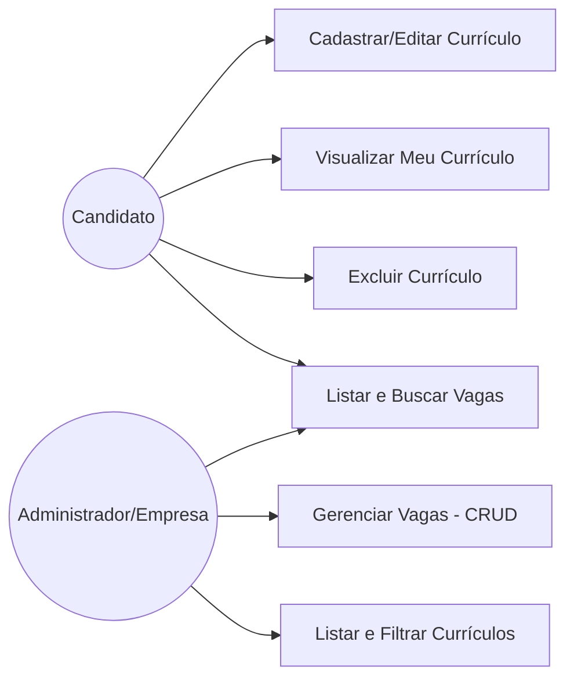
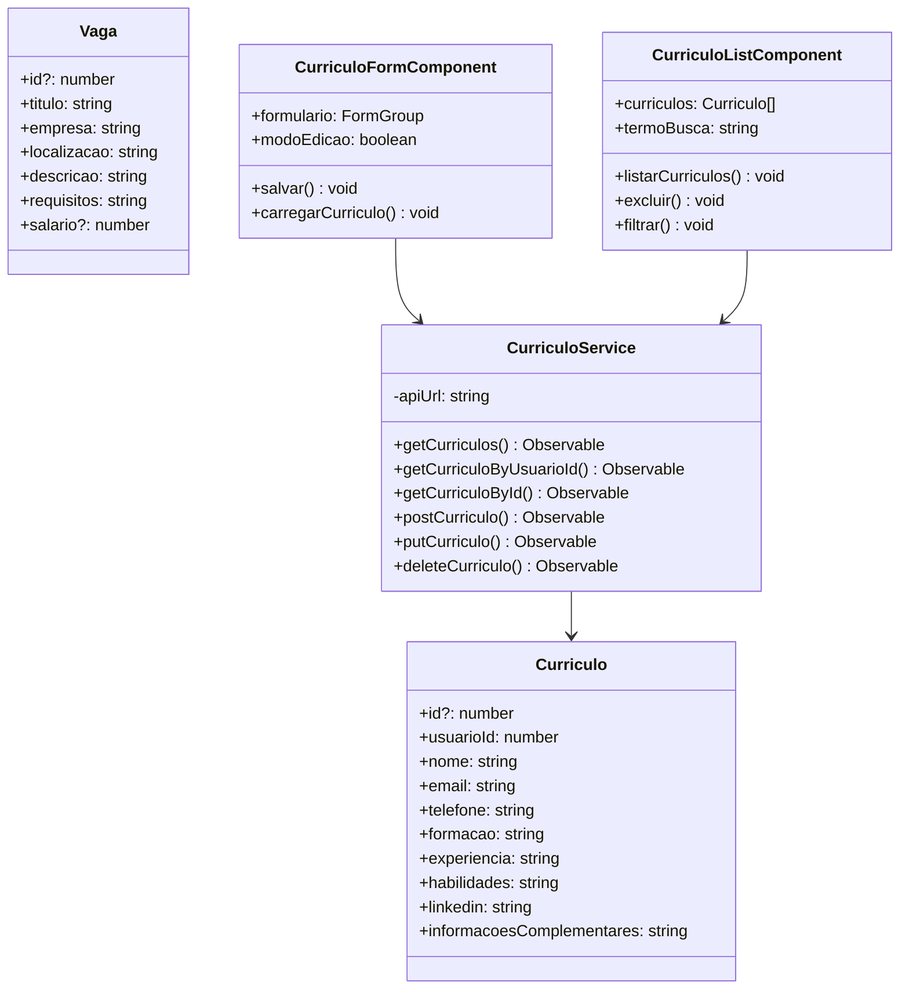
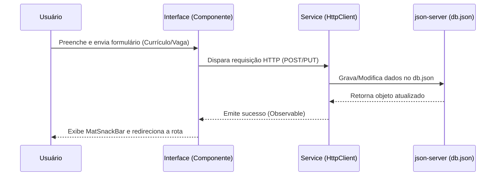

**Projeto:** Plataforma RH – Módulo de Vagas e Currículos
**Versão:** 1.0
**Data:** 18/06/2026

---

# 1. Introdução
## 1.1 Propósito
Este documento descreve os requisitos funcionais e não funcionais para o Módulo de Vagas e o Módulo de Currículos da Plataforma RH. O objetivo é detalhar as regras e fluxos que permitem que candidatos realizem o gerenciamento completo de seus currículos (incluindo cadastro, edição, visualização e exclusão), busquem vagas disponíveis, e que administradores e empresas gerenciem o painel de vagas e visualizem os currículos vinculados às candidaturas.

## 1.2 Escopo
O sistema compreende o desenvolvimento de uma interface frontend utilizando **Angular 21** integrada a um backend simulado através do **json-server**.
O sistema unificado permite:
 * **Gestão de Currículos:** Cadastro, edição, visualização e exclusão de informações profissionais por parte dos candidatos, com persistência e filtros por ID de usuário;
 * **Gestão de Vagas:** Listagem pública de oportunidades e painel administrativo (CRUD) para gerenciamento de vagas por empresas e administradores;
 * **Persistência:** Armazenamento centralizado dos dados em um arquivo local backend/db.json;
 * **Navegação:** Transição entre telas gerenciada via Angular Router (Single Page Application), sem recarregamento de página;
 * **Interface e Validação:** Utilização de formulários reativos com validações robustas e design responsivo baseado em componentes do Angular Material.

---

# 2. Descrição Geral
## 2.1 Objetivos de Aprendizagem
Ao final desta situação de aprendizagem, será possível:
 * Compreender e implementar interfaces de dados para Vagas e Currículos;
 * Criar e utilizar serviços Angular com HttpClient para realizar operações CRUD completas;
 * Desenvolver formulários reativos com validações customizadas e nativas;
 * Configurar e gerenciar o sistema de rotas dinâmicas no Angular;
 * Organizar o código em componentes reutilizáveis, aplicando boas práticas de arquitetura frontend;
 * Implementar interfaces modernas, limpas e intuitivas utilizando Angular Material;
 * Garantir a consistência de dados consumidos a partir de um servidor mockado.

## 2.2 Cenário
Na Plataforma RH, os usuários recém-cadastrados (candidatos) necessitam de um local centralizado para registrar suas informações profissionais detalhadas (como formação acadêmica, experiências, habilidades e perfil LinkedIn). Paralelamente, empresas e administradores precisam publicar e gerenciar vagas de emprego disponíveis no mercado.
Essas informações são armazenadas no backend simulado. Os candidatos buscam vagas e gerenciam seus perfis profissionais, enquanto as empresas filtram currículos e atualizam suas vagas abertas através do painel corporativo.

---

# 3. Requisitos do Sistema
## 3.1 Requisitos Funcionais (RF)
### Módulo de Currículos
 * **RF01 – Cadastro de Currículo:** O sistema permite que o usuário crie um currículo preenchendo: Nome completo, E-mail, Telefone, Formação acadêmica, Experiência profissional, Habilidades, Perfil LinkedIn (opcional) e Informações complementares.
 * **RF02 – Vinculação ao Usuário:** O currículo é associado obrigatoriamente ao usuário logado através do campo usuarioId (simulado com ID fixo 1 para fins didáticos).
 * **RF03 – Edição de Currículo:** O sistema permite que o usuário altere informações previamente cadastradas através da rota /curriculos/editar/:id.
 * **RF04 – Visualização de Currículo:** O usuário pode visualizar seu próprio currículo completo em /meu-curriculo, renderizado com layout de perfil profissional.
 * **RF05 – Exclusão de Currículo:** O sistema permite a remoção do currículo mediante confirmação prévia do usuário.
 * **RF07 – Busca e Filtro de Currículo por Usuário:** O serviço recupera e filtra currículos pelo identificador do usuário usando query string do json-server (?usuarioId=1).
### Módulo de Vagas e Administração
 * **RF06 – Listagem de Currículos (Visão Admin/Empresa):** A rota /curriculos disponibiliza uma listagem para administradores e empresas com mecanismo de busca por nome, habilidade ou formação.
 * **RF11 – Listagem Pública de Vagas:** O sistema disponibiliza uma listagem aberta de oportunidades profissionais na rota /vagas.
 * **RF12 – Painel Administrativo de Vagas (CRUD):** A rota /painel-vagas permite que administradores criem, visualizem, editem e excluam vagas de emprego da plataforma.
### Requisitos Globais de Sistema
 * **RF08 – Persistência de Dados:** Todos os dados de vagas e currículos são armazenados e recuperados dinamicamente através do json-server (backend/db.json).
 * **RF09 – Feedback ao Usuário:** Mensagens instantâneas informando sucesso ou falha (ex: MatSnackBar) são exibidas após cada operação CRUD (salvar, editar ou excluir).
 * **RF10 – Navegação:** O Angular Router gerencia toda a navegação entre as telas de forma fluida, sem recarregar a aplicação.

## 3.2 Requisitos Não Funcionais (RNF)
| Código | Requisito | Status |
|---|---|---|
| RNF01 | Frontend desenvolvido em Angular 21 | ✅ |
| RNF02 | Backend simulado e persistido com json-server | ✅ |
| RNF03 | Interface responsiva adaptável (mobile e desktop) | ✅ |
| RNF04 | Navegação intuitiva, limpa e de fácil utilização | ✅ |
| RNF05 | Componentes modulares, organizados e reutilizáveis | ✅ |
| RNF06 | Formulários Reativos (ReactiveFormsModule) para validação e captura | ✅ |
| RNF07 | Validação adequada de campos obrigatórios e formatos (E-mail, URL) | ✅ |
| RNF08 | Desempenho adequado das operações CRUD em ambiente local | ✅ |
| RNF09 | Manutenibilidade do código seguindo as boas práticas do Angular | ✅ |
| RNF10 | Experiência do usuário aprimorada utilizando componentes do Angular Material | ✅ |

---

# 4. Interface de Dados e Modelagem do Sistema
## 4.1 Models do Sistema
### Model de Currículo
```typescript
// src/app/model/curriculo.model.ts
export interface Curriculo {
  id?: number;
  usuarioId: number;
  nome: string;
  email: string;
  telefone: string;
  formacao: string;
  experiencia: string;
  habilidades: string;
  linkedin: string;
  informacoesComplementares?: string;
}

```
### Model de Vaga (Representação de dados complementar)
```typescript
// src/app/model/vaga.model.ts
export interface Vaga {
  id?: number;
  titulo: string;
  empresa: string;
  localizacao: string;
  descricao: string;
  requisitos: string;
  salario?: number;
}

```
## 4.2 Serviços HTTP
### CurriculoService
```typescript
// src/app/service/curriculo.service.ts
getCurriculos(): Observable<Curriculo[]>
getCurriculoByUsuarioId(usuarioId: number): Observable<Curriculo[]>
getCurriculoById(id: number): Observable<Curriculo>
postCurriculo(curriculo: Curriculo): Observable<Curriculo>
putCurriculo(curriculo: Curriculo): Observable<Curriculo>
deleteCurriculo(id: number): Observable<void>

```
*(Adiciona-se analogamente o serviço responsável pelo gerenciamento do CRUD de vagas integrando-se à URL base do json-server).*

## 4.3 Rotas Configuradas
| Rota | Componente | Descrição |
|---|---|---|
| / | InicioComponent | Página inicial da plataforma |
| /vagas | VagasComponent | Listagem pública de vagas de emprego |
| /painel-vagas | PainelVagasComponent | CRUD administrativo e gerencial de vagas |
| /curriculos | CurriculoListComponent | Listagem de currículos disponível para admin/empresas |
| /curriculos/novo | CurriculoFormComponent | Formuário para cadastrar novo currículo |
| /curriculos/editar/:id | CurriculoFormComponent | Formulário para editar currículo existente via ID |
| /curriculos/detalhe/:id | CurriculoDetailComponent | Visualização detalhada de um currículo específico |
| /meu-curriculo | MeuCurriculoComponent | Visualização do currículo do candidato logado |

## 4.4 Componentes Implementados
### CurriculoFormComponent
 * Cadastro e edição de currículo (modo detectado dinamicamente via parâmetro :id presente na rota ativa);
 * Formulário reativo estruturado através do FormBuilder;
 * Validações rigorosas: campos obrigatórios, correspondência de e-mail, minlength e formato de URL;
 * Feedback visual em tempo real por campo e tratamento de erros no envio;
 * Redirecionamento automático do usuário para /meu-curriculo após a persistência bem-sucedida.
### CurriculoListComponent
 * Painel de listagem de todos os currículos (visão analítica para empresas);
 * Campo de busca global em tempo real (filtros por nome, habilidade ou formação);
 * Ações em tabela/cards por linha: Detalhar (Ver), Editar e Excluir;
 * Diálogo de confirmação de segurança antes da exclusão de qualquer registro;
 * Contador dinâmico exibindo a quantidade de currículos encontrados após os filtros.
### CurriculoDetailComponent
 * Exibição limpa e detalhada de um currículo individualizado;
 * Elemento visual de Avatar gerado automaticamente com base na inicial do nome do candidato;
 * Renderização de tags visuais dinâmicas baseadas nas habilidades listadas;
 * Links de redirecionamento direto para o perfil do LinkedIn e atalho para edição.
### MeuCurriculoComponent
 * Dashboard privado do candidato para gerenciamento do seu perfil profissional;
 * Consulta automática ao backend baseando-se no usuarioId simulado;
 * Tratamento de estado vazio (*empty state*) com um botão de ação (*call-to-action*) amigável para criação do primeiro currículo;
 * Botões de ação rápida para edição e exclusão integrados à tela.
### Componentes de Vagas (VagasComponent e PainelVagasComponent)
 * Listagem responsiva contendo filtros de busca para que usuários visualizem as vagas ativas;
 * Painel administrativo exclusivo para criação, leitura, atualização e deleção das oportunidades ofertadas pelas empresas parceiras.

## 4.5 Diagramas e Fluxos do Sistema
### 4.5.1 Diagrama de Uso

### 4.5.2 Diagrama de Classes

### 4.5.3 Diagrama de Fluxo (CRUD)


---

# 5. Critérios de Aceitação
| # | Critério de Aceitação | Módulo Relacionado | Status |
|---|---|---|---|
| **1** | **Operações CRUD Completas:** É possível criar, ler, atualizar e excluir registros (tanto em Vagas quanto em Currículos) no arquivo db.json através da interface visual? | Geral | ✅ |
| **2** | **Navegação Limpa:** As rotas configuradas direcionam para os componentes corretos sem emitir quebras ou erros no console do navegador? | Geral | ✅ |
| **3** | **Feedback Visual Operacional:** O usuário recebe uma confirmação explícita em tempo real (ex: MatSnackBar) ao salvar, alterar ou deletar dados? | Geral | ✅ |
| **4** | **Consistência e Sincronismo:** Os dados exibidos nas tabelas e cards correspondem exatamente ao estado atual armazenado no backend simulado? | Geral | ✅ |
| **5** | **Bloqueio de Dados Inválidos:** Os validadores dos formulários reativos impedem submissões caso existam campos obrigatórios vazios ou formatos incorretos? | Geral | ✅ |
| **6** | **Relação de Dono:** O currículo é corretamente amarrado e filtrado através do usuarioId ativo? | Currículos | ✅ |
| **7** | **Visão Administrativa:** Administradores e empresas conseguem acessar a listagem global e usar a busca por habilidades ou vagas sem interrupções? | Geral | ✅ |
| **8** | **Persistência Pós-Reload:** Os registros criados continuam disponíveis na listagem mesmo após reiniciar a aplicação ou atualizar a página? | Geral | ✅ |

---

# 6. Configuração do Ambiente
Para executar localmente o projeto com os módulos de vagas e currículos integrados:
 1. **Instalação de Dependências:** Instale as dependências do projeto Angular através do gerenciador de pacotes:
   ```bash
   npm install
   
   ```
```
2. **Inicialização do Servidor Backend Mock:** Inicie o `json-server` apontando para o diretório correto do arquivo contendo os nós de `vagas` e `curriculos`:
   ```bash
   npx json-server --watch backend/db.json --port 3000

```
 3. **Execução do Frontend:** Em outro terminal, inicialize o servidor de desenvolvimento do Angular:
   ```bash
   ng serve
   
   ```
```
4. **Acesso ao Sistema:** Abra o navegador no endereço `http://localhost:4200` para validar o fluxo operacional de ambos os módulos.

```